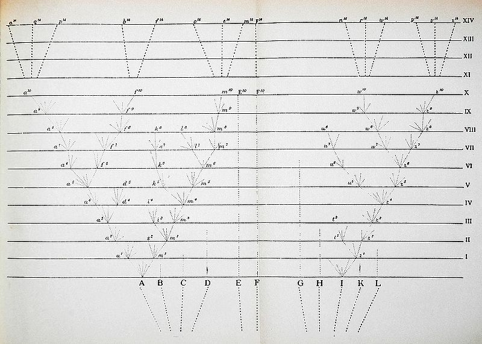
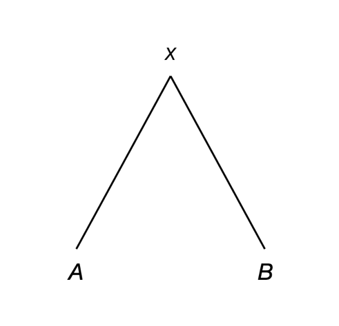
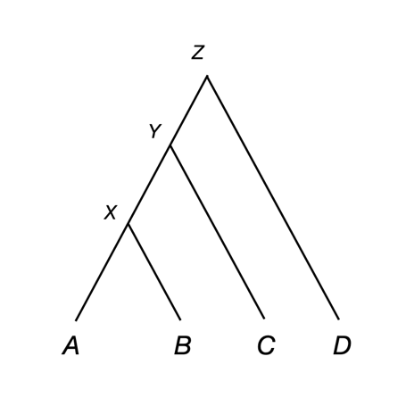
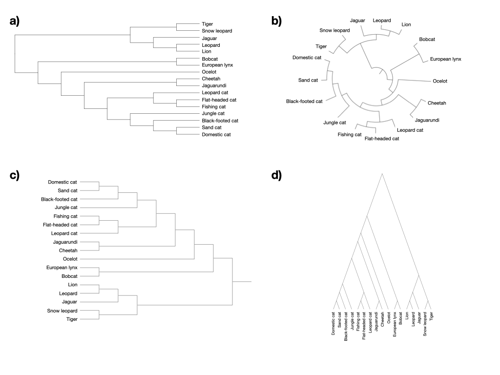
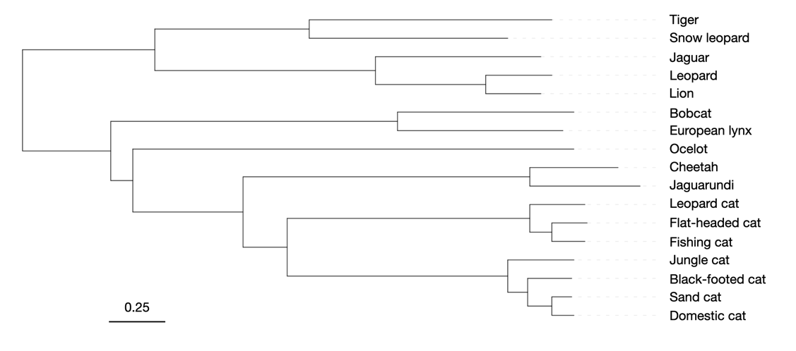
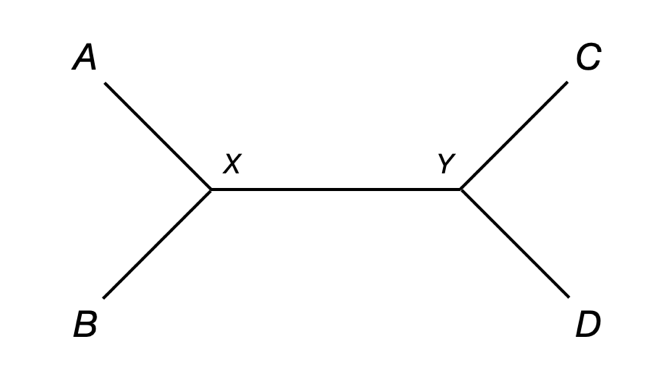
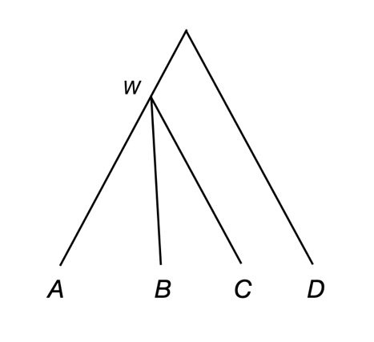

XXVIII Phylogenetic tree building

**1 Introduction to phylogenetic trees**

 **1.1 What is a phylogenetic tree?**

All individuals within a species share a common ancestor, as in fact does all life on Earth. We represent the patterns of relatedness among these species with a phylogenetic tree (or phylogeny), which represents their history of common ancestry and divergence.

While Charles Darwin was not the first to use a tree as a metaphor for evolutionary relationships—and he likely did not intend his tree to be read in the same way as we do today—the following tree diagram is the only figure in his book, *On the Origin of Species*:



(Figure from Darwin,see [^1])


**1.2 How do we read a tree?**

Phylogenetic trees represent the hierarchical relationships among species or individuals (“species *A* is closer to *B* than it is to *C*”) and sometimes also the amount of time separating two species or individuals (“*A* and *B* shared an ancestor approximately 10 million years ago”). In addition, trees can be used to make inferences about organisms that no longer exist. We simply have to learn how to read them.

The simplest tree has two tips (or external nodes) and one internal node:



Here, the tips represent individuals, taxa, or species (we will mostly just refer to them as species for now) sampled from nature (*A* and *B*), as well as their common ancestor (*X*). Any two species on Earth have these relationships. The tips of the tree, *A* and *B*, represent the current day and the internal node, *X*, represents an ancestor that is no longer around. This common ancestor gave rise to the species we see today, with evolution happening along the two branches connecting the ancestor with its descendant species, *A* and *B*. Neither *A* nor *B* is more closely related to the ancestral node (*X*), and neither *A* nor *B* can be said to be the ancestor of the other.

When trees have more than two tips, we must also consider a number of additional features. The following tree shows the relationships among four species:



Now that there are more than two species, there is the possibility that some species are more closely related than others. For instance, species *A* and *B* are more closely related to each other than either is to *C*. Importantly, *A* and *B* are also *equally* related to species *C*—there is no importance attached to the ordering of tips left-to-right, and all trees can be rotated around nodes without any change in meaning. The most straightforward way to measure relative relatedness is to ask how old the most recent common ancestor (MRCA) is between any two species. The MRCA of species *A* and *B* (labeled *X*) existed more recently than the MRCA of species *A* and *C* (labeled *Y*), so *A* and *B* are more closely related than *A* and *C*. Likewise, species *A* and *C* are more closely related than species *A* and *D* because they share a more recent common ancestor. Given this tree, it is also true that species *B* and *C* are more closely related than *B* and *D*.

What exactly do the branches and nodes of a tree mean? In general, the tips or external nodes of a tree represent individuals or species alive today. There are several unusual scenarios where we have data from samples that are no longer around, because we can now collect DNA from ancient samples and even recently extinct species. In such cases tips represent nodes from which we have collected data. In either case, the internal nodes represent the ancestors of these descendant lineages, and therefore species that are extinct today. Evolution between these ancestors and their descendants occurs along each branch, always in a direction that goes from the past to the present. Internal nodes also represent speciation events: the splitting of one ancestral species into multiple descendant species. The deepest node (labeled *Z* above) is called the root of the tree, and represents the ancestor of all sampled species.

**1.3 How do we draw a tree?**

There are many different ways to draw a tree that have no effect on its meaning. The figure below shows four different ways to draw the same exact set of relationships among different big cat species (trees modified from <https://pubmed.ncbi.nlm.nih.gov/28776029/> and https://pubmed.ncbi.nlm.nih.gov/31198971/).



Choosing one version of a tree over another is largely a design decision, though making the species names readable when there are many tips can be a deciding factor (in which case panel **a** would be a good choice). Many programs that draw trees will also order the tips in such a way that the root is not centered. Instead, species with the fewest internal nodes on the path between the root and tip are plotted closest to the root (i.e. more directly under it) and those with the most internal nodes are plotted furthest away. This method can produce more readable trees, though many people may mistakenly believe that this ordering has biological meaning. Such an algorithm has been used in panels **a**, **b**, and **c** in the big cat trees above.

Finally, although the root node represents the ancestor of all taxa sampled, there is always a long evolutionary history preceding the appearance of this ancestral species. It is therefore typical to show a bit of the branch leading to the root (as shown in panels **b** and **c** above), though nothing special is implied if this short branch is omitted.

**1.4 Did all the tips of the tree evolve for the same amount of time?**

Yes, usually. As mentioned above, we generally sample all tips at the same time, from living organisms, in which case all species evolved for the same amount of time since their common ancestor. In other words, no species is “more evolved” than another. For example, if we make a simple two-tip tree relating humans and *E. coli*, it would look exactly like the two-tip tree of species *A* and *B* drawn above. Both humans and *E. coli* have evolved for more than a billion years since their common ancestor, even if *E. coli* is more likely to physically resemble this ancestor (which was almost certainly also single-celled).

**1.5 What do branch lengths mean?**

The length of branches in phylogenetic trees can have multiple meanings, and researchers usually need to specify exactly what is being shown. Often, trees are shown with branches proportional to time (sometimes called a “chronogram”). Although there are many challenges to accurately estimating such times, this is the most natural way to represent phylogenetic relationships.

Alternatively, one can draw a tree so that it captures the hierarchical relationships among tips, but without any information about time or the amount of evolution. This type of tree (called a “cladogram”) has an arbitrary branch length after each speciation event, which can be useful for making the tree as readable as possible. All of the big cat trees above are cladograms. While this may not seem like the most useful tree, if no information about branch lengths is known it can be a much more honest representation; it also can make it much easier to label internal branches with additional information.

Finally, trees can be drawn with branch lengths proportional to the amount of evolution *in some particular character or measurement* (these are called “phylograms”). Most commonly, branch lengths are drawn as proportional to the number of nucleotide or amino acid substitutions that have occurred along them; however, branch lengths can be drawn to be proportional to many different kinds of measures. Phylograms rarely have the same distance from the root to all tips, as even tips that have been evolving for the same amount of time can have different numbers of changes. In order to interpret branch lengths in a phylogram, a scale bar is often included to show how much evolution has occurred. A hypothetical example is shown below with the scale bar denoting the number of nucleotide substitutions per site, a common metric.



**1.6 Are all trees rooted?**

The root of the tree is the oldest internal node. This means that it represents the common ancestor of all species in the tree, and also therefore the organism that existed the longest ago in the tree. Of course the root itself had ancestors, but these ancestors are not represented by any species that are not also descendants of the root in a particular tree.

The root of a tree is valuable, but sometimes hard to identify. It is hard to find the root because most common methods for inferring trees (which are covered below) cannot infer rooted trees. Instead, they infer unrooted trees. An example of an unrooted tree is shown here—it has the same information as the tree with the same species above, but the root (node *Z*) has been removed.



Removing the root has a number of consequences. Most importantly, we are no longer sure about the direction of evolution. We know that the tips exist today, but we no longer know where the most recent common ancestor of all our species should be placed on the tree. Since the root represents this common ancestor, it also represents the point in the past from which all current species evolved, and therefore also tells us the direction of evolution. All of this means that unrooted trees cannot be represented as chronograms, but they can be represented as either cladograms (as shown) or phylograms.

Finding the root involves deciding which branch of an unrooted tree the root node should be placed on. In order to turn the above unrooted tree into the rooted representation shown earlier, we would need to place the root on the branch between nodes *Y* and *D*.

There are a number of different ways to find the root a tree. The two most common are "midpoint" rooting and "outgroup" rooting. Midpoint rooting finds the point on an unrooted tree that minimizes the distance between this point and all the tips. It requires that the unrooted tree be a phylogram, as it is trying to minimize the evolutionary distance in the branch lengths being considered. Midpoint rooting is therefore most commonly used when unrooted trees are inferred from DNA sequence data. Outgroup rooting requires that we also sample one or more species that are definitely not a descendant of the root node. This species or species is called an outgroup because it is not in the group of species that is the focus of our study. To illustrate this, imagine in the big cat example above we wanted to find the root: choosing a dog as an outgroup would be perfect, as we know it is not in the big cat clade. While there are some complexities to picking an outgroup—for instance, we do not want it to be too distantly related—the point at which the branch leading to the outgroup attaches to our ingroup can be identified as the root.

**1.7 Are all trees binary?**

Speciation is a biological process that produces multiple species where there used to be just one. For both biological and practical reasons, we often only consider cases in which one species becomes two. We represent these splitting events in a tree as "bifurcations," and call trees that only have bifurcations in them "binary" trees. This means that internal nodes of our tree will only ever have two direct descendant branches.

However, trees do not have to be binary. As shown in the tree below, sometimes an internal node (node *W* in this case) can have more than two descendants. We call such splitting events "multifurcations," and say that our tree has a "polytomy" if it contains such nodes. Polytomies can appear in a tree for two distinct reasons. Though it may be rare, it is possible for one species to split into three species at essentially the same point in time. When polytomies are due to biological causes such as this, we refer to them as "hard" polytomies. In contrast, sometimes we are simply unsure of the correct ordering of relationships. In the tree shown here, perhaps we are unsure as to whether the two most closely related species should be *A* and *B*, *A* and *C*, or *B* and *C*. As a result, we simply represent the tree with a "soft" polytomy—one that reflects our lack of knowledge about relationships.



Practically, most software can only deal with bifurcating trees as input, so it is important to represent a tree as binary. If hierarchical relationships cannot be determined among species, most software will randomly resolve them in order to output a binary tree. On the other hand, occasionally software will collapse extremely short internal branches, representing the descendant relationships as a polytomy instead. It is important to know the behavior of whichever software you are using.

**1.8 How do we make a machine-readable tree?**

There is a common format for representing phylogenetic trees: the Newick format. It is named for the restaurant in New Hampshire where a group of researchers decided on its structure. While there are some other formats around, Newick-formatted trees are nearly universally recognized by bioinformatics software.

The Newick format uses a series of nested parentheses to represent hierarchical relationships. In addition to relationships, it allows one to provide branch lengths and branch labels. Newick trees are naturally rooted, but most software for visualizing trees (see next sub-section) will allow you to view them as unrooted. Below are some simple representations of different types of trees:

This one has no branch lengths and no internal nodes named:
```bash
((((A,B),C),D));
```

Still no branch lengths, but now internal nodes are named:
```bash
((((A,B)X,C)Y,D)Z);
```

This time with branch lengths, but no internal nodes named:
```bash
((((A:1,B:1):0.5,C:1.5):0.25,D:1.75));
```
Both branch lengths and internal nodes are named:
```bash
((((A:1,B:1)X:0.5,C:1.5)Y:0.25,D:1.75)Z);
```
And if we want to represent a polytomy:
```bash
((A,B,C),D);
```
**1.9 How do we best visualize a tree?**

There are many tools for visualizing and drawing trees. Most of the figures shown here were made with the Interactive Tree of Life (iTOL) webserver[^3]. Other popular web-based tools include ETE[^4], IcyTree[^5], and T-REX[^6]. For more control over how to represent a tree and the information within it, phytools[^7] is a very popular R-based package.

[^3]: https://itol.embl.de/
[^4]: http://etetoolkit.org/treeview/
[^5]: https://icytree.org/
[^6]: http://www.trex.uqam.ca/
[^7]: https://github.com/liamrevell/phytools
[^2]: https://en.wikipedia.org/wiki/Tree\_of\_life\_(biology)\#/media/File:Origin\_of\_Species.svg
[^1]: https://en.m.wikipedia.org/wiki/File:Darwin_divergence.jpg
