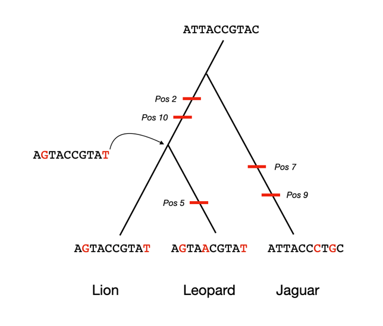
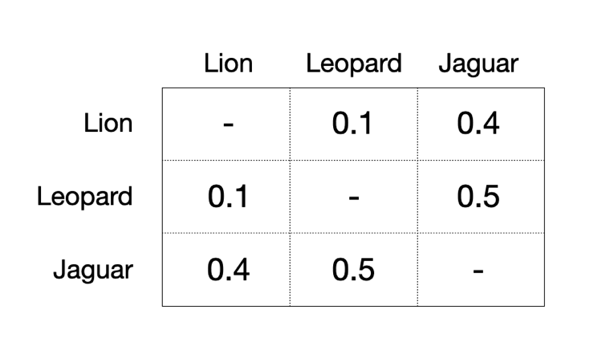
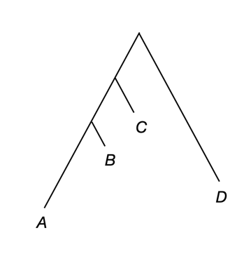
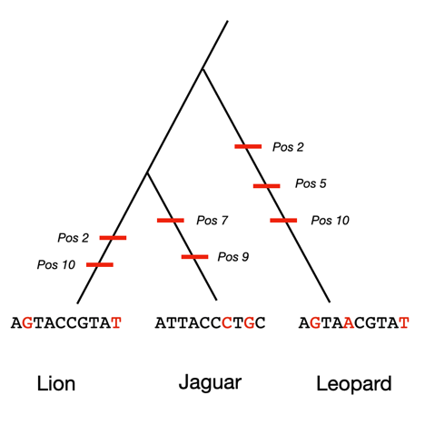
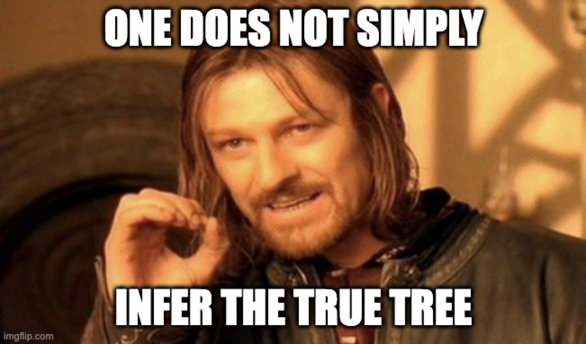
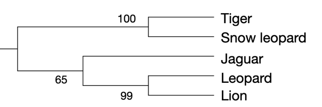

XXVIII Phylogenetic tree building

**2 How do we infer trees?**

Now that we understand what a phylogenetic tree shows, we want to be able to infer a tree ourselves. The task of building a tree is a statistical inference problem: there is no way to go back in history to observe a tree evolving through time. Even for trees evolving in real-time—as with viruses spreading through human populations—we must infer trees from data.

There are many methods for inferring phylogenetic trees, the first of which appeared in the 1960s. It is impossible to cover all such methods, especially as new ones come out all the time, but here we try to explain basic concepts as well as three common methods: distance, parsimony, and likelihood. Each method has its own advantages and disadvantages, though all will usually agree when applied to closely related species. Among more distantly related species, however, knowledge of which method to use in which circumstances will be important.

**2.1 How many possible trees are there?**

When contemplating the scale of the tree inference problem, it is useful to consider exactly how many tree topologies are possible. For a rooted, bifurcating tree with *n* tips, there are

$$
\frac{(2n - 3)!}{2^{(n - 2)} (n - 2)!}
$$

unique trees. That is a lot of trees\! For instance, with 3 tips there are 3 trees, with 4 tips 15 trees, and with 10 tips there are over 34 million trees. For trees with 50 tips there are more possible tree topologies than estimated atoms in the universe.

While these numbers are impressively large, their main implication is that no method will be able to consider every possible tree, and that finding the correct tree can be very difficult. Researchers regularly infer trees with hundreds of species in them, so it is impossible for any method to consider even a large fraction of possible topologies. Instead, we use different algorithms that help to speed-up the search or to determine the best topology.

**2.2 What data are used to infer trees?**

Because finding the best tree is an inference problem, we need data that we can use to infer trees from. We could use any trait that differs among species, as the process of evolution will ensure that more closely related species are more likely to share more similar traits, which in turn allows us to infer a tree. For instance, we could use feather color or leaf shape to help us to find the best tree. However, modern phylogenetics largely uses traits derived from DNA sequencing: either A, C, T, and G from nucleotide data, or the 20 different amino acids present in protein data. Besides being plentiful (genomes are large), DNA traits have the advantage of being present in every organism on Earth. This means that we can infer a tree from DNA data that includes a wide variety species, even those without feathers or leaves.

The fact that we largely use DNA sequences to infer trees also means that we can have thousands to millions of traits. Each nucleotide or amino acid provides information about evolutionary relationships, so our datasets are information-rich, possibly consisting of hundreds of tips and millions of traits. The methods we use to infer trees must therefore be able to scale both in the number of tips and the number of bases.

**2.3 How do DNA sequences evolve on trees?**

To better understand how methods for inferring trees from DNA sequences work, it is important to understand a little bit about how sequences evolve. Here we will just cover the basic ideas, without going into too much detail (there are whole textbooks devoted to the topic of molecular evolution).

The figure below shows a hypothetical sequence evolving on a phylogenetic tree relating lions, leopards, and jaguars. We start with a sequence present in the common ancestor of all three species, with nucleotide changes occurring at specific positions in the sequences at specific points in time. While the order of changes along a single branch does not matter—for example, it doesn’t matter whether position 2 or position 10 changes first, because they are on the same branch of the tree—which branch a change occurs on determines which species will inherit it. The tree topology therefore determines which mutations are shared between species, and which are unique to each species. Such patterns of mutation are what allow us to infer the shape of the tree using only data from the tips.



There are many concepts being represented in this figure that are important for biology, but perhaps not so important for a basic understanding of phylogenetic trees. For instance, each mutational change in the tree—identified here by a little red mark—represents a long process of mutational origin in one individual (e.g. TG at position 2) and then eventual fixation of the G nucleotide in all individuals. Our trees simply illustrate so much time (on an evolutionary scale) that even complex processes get represented as a single mark.

Perhaps the most important additional idea implied by the figure is that we are examining the “same” nucleotide sequence in all the current species. We can only compare the evolution of homologous nucleotide positions—those inherited from a common ancestor (see chapter 5.16). Though you may not have known it, the process of aligning sequences (Part XVI of this book) is in fact the method by which we identify homology. Alignments are assignments of homology among different positions in a set of sequences, and are therefore a very important first step in any phylogenetic inference. Because the example sequences here have no insertion or deletion mutations, the alignment would be simple to infer. However, over long periods of time, the task of alignment can become very difficult.

**2.4 How do we measure sequence divergence?**

Given a set of sequences, a key task is determining how similar or different they are, or what is often called “sequence divergence” or “genetic distance.” The easiest approach to measuring divergence between a pair of sequences is to count the number of positions at which they differ, dividing by the length of the sequence being compared. Sometimes this simple measure is called the “p-distance.” This way of quantifying genetic distance is directly related to the concept of percent identity seen earlier in the book (chapter 80.15). In fact, the p-distance is simply 1 minus the percent identity.

Consider a comparison of the lion and jaguar sequences given in the figure above:

```bash
AGTACCGTAT

ATTACCCTGC
```

Here, we would say that the genetic distance is 0.4 (because 4/10 positions are different) and the percent identity is 60% (because 6/10 positions are identical).

There are many more complex ways to measuring sequence divergence, some of which we mention below. Importantly, almost all such measures count only mismatches between nucleotides or amino acids, without considering insertions or deletions ("gap-excluded identity" in chapter 80.15). We do this because it is not clear whether we should count (for instance) a 2-bp indel as a single mutation event that spanned 2 bases, or two mutational events, each of 1-bp. As the goal of genetic distances is to quantify evolutionary distances, this distinction is important.

**2.5 Distance methods for tree inference**

We can now discuss the simplest set of methods for inferring phylogenetic trees: distance methods. Conceptually, all distance methods are similar, though they differ in many details.

Distance methods start by calculating pairwise sequence divergence between all sampled species. These distances are then often arranged into a distance matrix, which simply represents all of these measures in an easy-to-read format. Here is a distance matrix from the sequences given in the figure above (note that the matrix is symmetric, since all distances are pairwise):



The most popular and accurate distance method, called neighbor-joining[^1] (NJ), builds a tree by sequentially “joining” together the most closely related species in the distance matrix. After a pair of lineages is joined, it is represented as a single, new taxon in an updated distance matrix, and this series of steps is repeated until all lineages are joined together.

Although there is some nuance as to how exactly NJ defines the closest pair of species, it is a relatively easy-to-understand algorithm for building phylogenetic trees. Most importantly, at least in comparison to other methods used to infer trees, NJ is a deterministic algorithm that builds a tree very fast. Distance matrices are easy to calculate, and the actual NJ algorithm quickly assembles a tree from this matrix. There is no tree search (as in the other methods we will examine) and therefore no need to decide on an optimal tree topology among a set of possible topologies.

**2.6 Do sequences evolve at the same rate on all branches?**

No, DNA sequences do not evolve at the same rate on all branches of a phylogenetic tree. Sometimes these sequences have different rates because they have different functions—perhaps they act as protein-coding genes in some species but not all species. Other times, DNA repair enzymes are better or worse in some lineages, leading to slower or faster overall rates of sequence evolution.

Regardless of the reasons for so-called rate heterogeneity, it is observed quite frequently in nature. More crucially, some cases of rate heterogeneity can mislead distance-based methods for inferring phylogenies. Consider the following phylogram:



In this tree lineages *B* and *C* are evolving slowly, while lineages *A* and *D* are evolving rapidly. If we only considered the distance between species, we might incorrectly infer that species *B* and *C* are most closely related, as they have the shortest distance between them. In such cases, distance methods (including NJ) can give the wrong answer.

**2.7 Parsimony methods for tree inference**

Instead of simply calculating the genetic distance between sequences, it can be much better to pay attention to exactly which sites are the same or different between species. If a particular site differs between species, then there must have been at least one mutation on the lineage(s) separating them since their common ancestor. If a site is the same between species, then we do not have to propose that a mutation happened; however, it could be that there were two separate mutations, such that the two species ended up with the same nucleotide or amino acid (this happens surprisingly often). In general, any tree topology gives a particular set of relationships among species, and this set of relationships will imply some number of mutations necessary to explain the data.

Parsimony methods choose the tree topology that requires the smallest number of mutations­—or, more generally, evolutionary transitions—to explain the data. It may be easiest to explain this concept using the same big cat data as above, but with a different topology proposed as the phylogenetic tree relating the three species (lion and jaguar are now most closely related):



Here, the data provided are again the sequences at the tips, with the red marks now denoting a set of mutations that must be proposed to explain the data. We can see that instead of requiring only 5 mutations as in the correct tree, this topology requires that we propose 7 mutations. While there are other combinations of specific mutations that could explain the data with 7 changes, the match between lion and leopard at the 2<sup>nd</sup> and 10<sup>th</sup> positions in this topology must be due to multiple changes at this site at multiple places on the tree. Parsimony methods would choose the original topology (uniting lion and leopard) because it requires fewer changes.

In general, parsimony methods operate by calculating the cost (i.e. number of changes) on a large set of topologies, picking the topology with the lowest cost as the optimal one. This approach therefore requires that we consider a large number of topologies, as we are trying to find the optimal tree among a very large set of possible trees. While the search for the optimal tree will take much longer than NJ, fortunately there are many well-developed tree search algorithms that can do this relatively quickly and accurately.

**2.8 What are substitution models?**

Even the greater complexity added by parsimony methods is sometimes not enough to overcome extreme rate-heterogeneity in sequence evolution, leading such methods to find the wrong tree. In part, this is because there are only four nucleotides.

Because there are so few possible DNA states, there will often be identical positions between species even when multiple changes have occurred in their history. For example, two species may both have G, but only because there have been multiple mutations along one branch: G->T->G. Similarly, two species may differ at one site at which more than one mutation occurred: G->T->A. We might imagine that either of these cases would be more likely to occur between two distantly related species relative to two closely related species, as there will simply be more time for multiple changes to have occurred.

In all cases like the ones above (and even for amino acid sequences), it helps to have a model of substitution. Such models can represent the probability of different numbers of changes between sequences, above and beyond a simple count of differences. One key property of substitution models is that they consider how distantly related two sequences are, which helps to determine the probability of change. For two sequences that are closely related, p-distances are probably an accurate measure of genetic distance; for distantly related species, there are many “hidden” events that must be accounted for.

Substitution models are in wide use, and in fact the alignment scoring matrices introduced in chapter 81 are a form of substitution model. The simplest and most widely used substitution model is the Jukes-Cantor model, which treats every nucleotide the same; more complex models can have different probabilities of change for different types of change.

Most importantly, having a probabilistic model of sequence evolution means that we can have probabilistic methods for inferring phylogenetic trees.

**2.9 Likelihood methods for tree inference**

By far the most accurate class of methods to infer a phylogeny from sequence data use likelihood. Likelihood methods combine probabilistic substitution models with tree search to find the topology with the maximum likelihood. Essentially, this tree will have the highest probability of explaining the sequence data.

As in parsimony methods, likelihood methods must evaluate the probability of the data on many different tree topologies, finding the one with the maximum likelihood. Such methods must therefore consider many different tree topologies, calculating the likelihood of the data on each. These steps are again more computationally costly than either NJ or parsimony, but widely used software can quickly infer trees with millions of sites and hundreds of tips.

There is no simple diagram to represent likelihood search or likelihood calculations—you’ll just have to accept that this is the best way to infer a tree.

**2.10 Can we trust our tree?**

So, you’ve inferred a tree. Do you now have the true set of relationships among species? No.



Every tree is an inference from data. Therefore, its final state depends on the quality of your input data as well as the accuracy of your inference method. We generally (and accurately) refer to the trees we infer as hypotheses about species relationships.

**2.11 How do we measure confidence in a tree?**

Just because we are not assured of inferring the correct tree doesn’t mean we can’t express our confidence in our favorite tree topology. Measures of statistical confidence are important for any kind of inference, including phylogenetic trees.

By far the most common method for measuring confidence in a tree topology is the bootstrap. The details can vary, but the simplest way to carry out the bootstrap is to sample (with replacement) from your alignment, and then to build a new tree “from scratch.” This tree may be the same as your original tree or it may differ—it might differ at only a single branch among hundreds of branches. The bootstrap generally proceeds by repeating this procedure a large number of times, but usually 100 times in phylogenetics.

After we have carried out this procedure, for every branch in our original inferred tree we can report how many times we observed that branch in our bootstrapped sample (out of 100). Often the results will look like this:



Here, our results say that we saw the grouping of tiger + snow leopard in 100% of our bootstrapped samples and leopard + lion in 99% of our samples. Both seem highly supported. However, the grouping of lion, leopard, and jaguar together was not seen as often (only 65% of the time), which means we should be less confident in this set of relationships. The bootstrap values do not immediately tell us what the other topologies observed were, only that these three species were not always in a group to the exclusion of all other species. (The root branch, by convention, does not usually have a bootstrap value on it.)

Finally, one annoying thing about bootstrap values: they are specific to a given method used to infer a tree and a given dataset. So parsimony and likelihood could each give 100% bootstrap support to different relationships—it’s simply that parsimony always infers one set and likelihood always infers another. Additional methods or arguments are needed to decide among different models.

[^1]:  https://doi.org/10.1093/oxfordjournals.molbev.a040454
