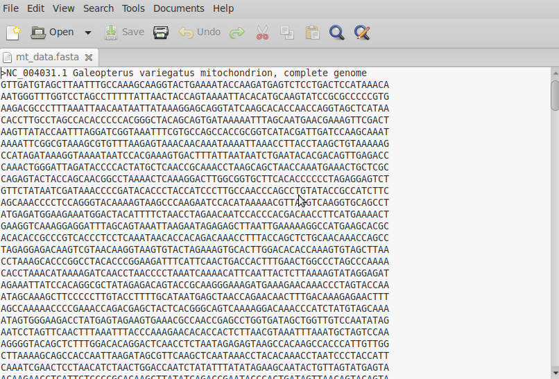
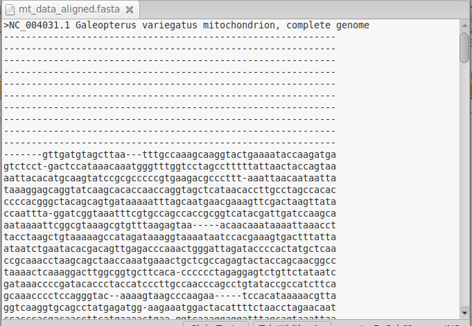
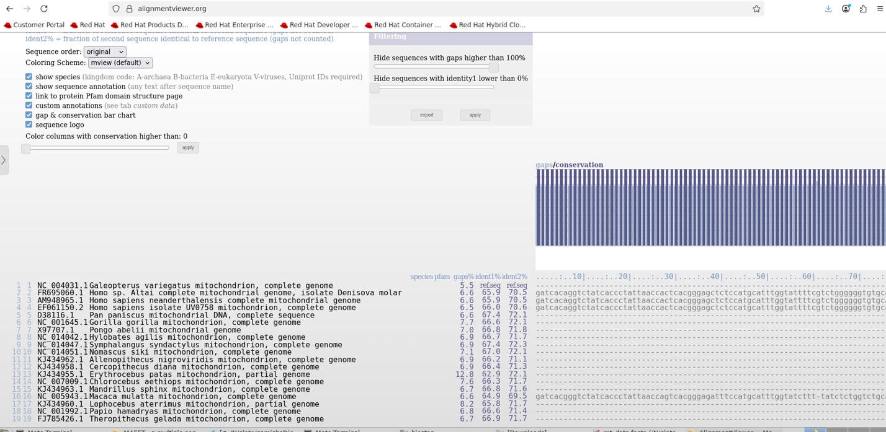
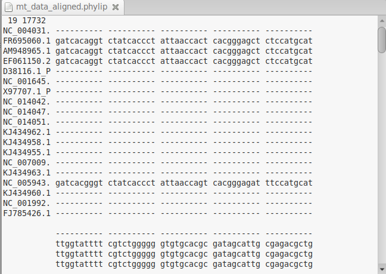
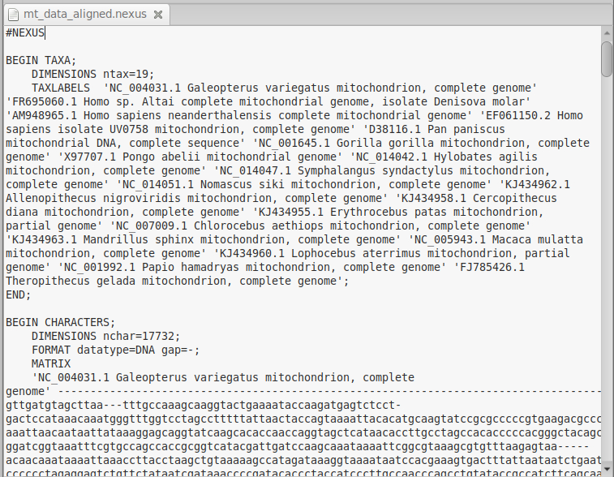
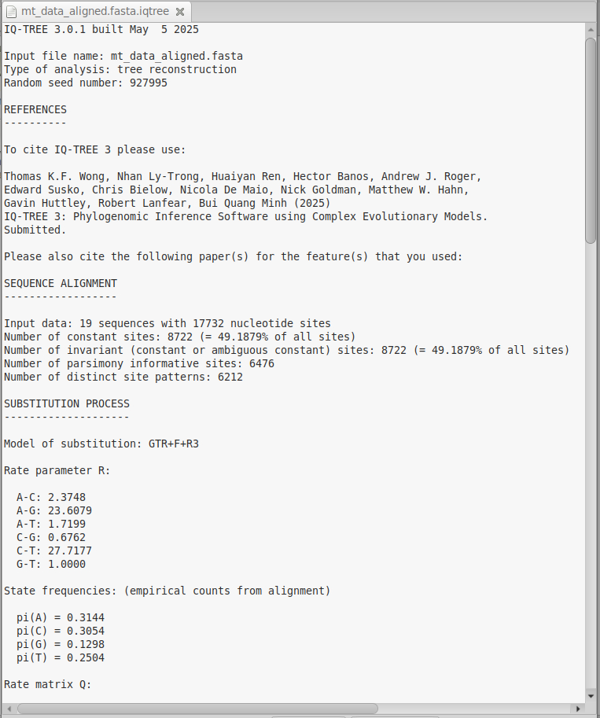
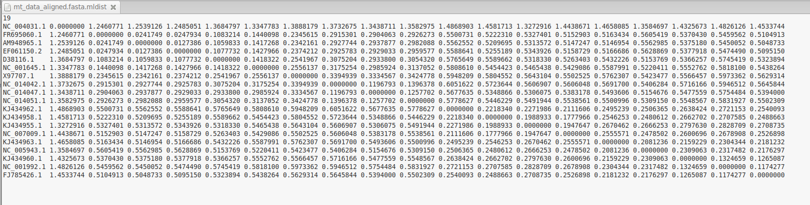
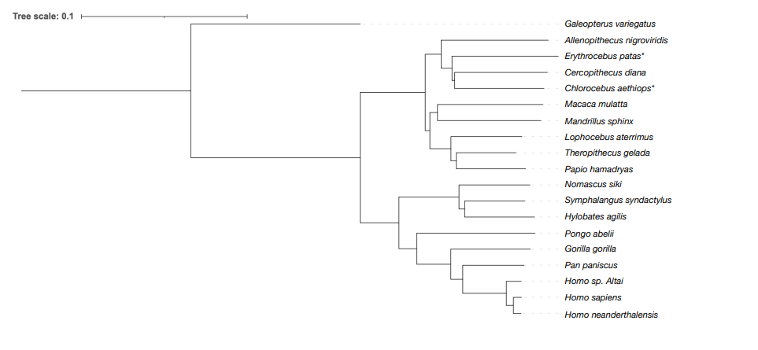
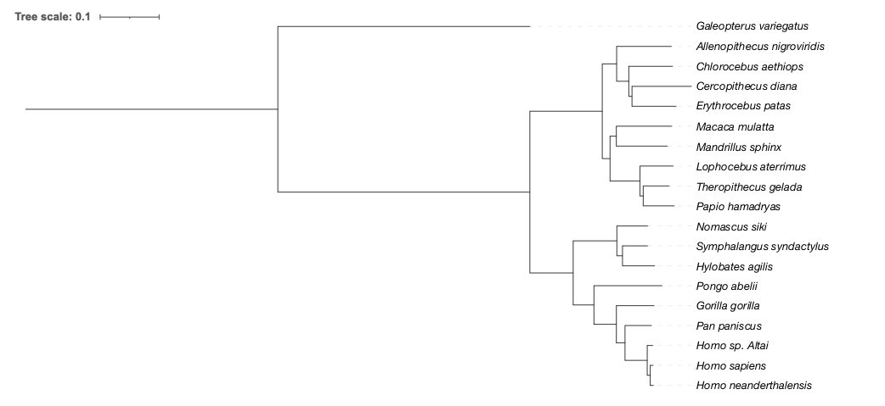

XXVIII Phylogenetic tree building

**3 Inferring a tree**

**3.1 How are the primates related?**

Now we’re going to build a phylogenetic tree ourselves, using some of the methods we’ve just gone over. We will focus on relationships among the primates, a group that includes humans.

While there are hundreds of whole genomes available from many different primate species, we’re going to use a handful of species (and samples of extinct relatives of humans) from a published study on the primate phylogeny[^1]. To make the problem even more manageable, this study only uses the mitochondrial genome (often abbreviated as “mtDNA”) from each species. The animal mitochondrion has a separate genome from the nuclear one, a mere 16 kilobases long. In addition to being shorter, mtDNA in animals has a higher rate of nucleotide substitution, which means it also has a large number of characters with which to infer a phylogeny among relatively closely related species.

**3.2 How do I get the sequence data?**

1\. We will use the same mtDNA as in the paper, but only for the following samples:

| **Species**                   | **NCBI Accession #** |
| ----------------------------- | --------------------- |
| *Galeopterus variegatus*      | NC\_004031            |
| *Homo sp. Altai*              | FR695060              |
| *Homo neanderthalensis*       | AM948965              |
| *Homo sapiens*                | EF061150              |
| *Pan paniscus*                | D38116                |
| *Gorilla gorilla*             | NC\_001645            |
| *Pongo abelii*                | X97707                |
| *Hylobates agilis*            | NC\_014042            |
| *Symphalangus syndactylus*    | NC\_014047            |
| *Nomascus siki*               | NC\_014051            |
| *Allenopithecus nigroviridis* | KJ434962              |
| *Cercopithecus diana*         | KJ434958              |
| *Erythrocebus patas*          | KJ434955              |
| *Chlorocebus aethiops*        | NC\_007009            |
| *Mandrillus sphinx*           | KJ434963              |
| *Macaca mulatta*              | NC\_005943            |
| *Lophocebus aterrimus*        | KJ434960              |
| *Papio hamadryas*             | NC\_001992            |
| *Theropithecus gelada*        | FJ785426              |

2\. To get the sequence data for each species, simply download them from NCBI.

a) Go to <https://www.ncbi.nlm.nih.gov/nuccore>

b) Enter the NCBI accession number from the table in the search box.


c) Click on the FASTA link—this will bring you to a FASTA-formatted page.


d) Copy the entire sequence (complete with the header line) into a new file, where you will put all the sequences. Add a new line to the file after you’ve pasted in the sequence.



3\. Once you have copied the sequence for one species, repeat step 2 for all the species.

4\. Once you’ve completed copying, save the file as `mt\_data.fasta`. This file should contain sequences from all the species you’ll use, each separated by a blank line.

**3.3 How do I align the data?**

Now that we have our sequences, we need to align them. We will use MAFFT to do this, but you can use any multiple sequence alignment tool.

1.  Installation: Follow the instructions at <https://mafft.cbrc.jp/alignment/software/> to install MAFFT on your machine.

3.  Usage: Once you have installed MAFFT, open a terminal window in the folder containing `mt\_data.fasta`. Type 

```bash
mafft --auto mt\_data.fasta \> mt\_data\_aligned.fasta.
```
5.  Output: You should now have the aligned sequences in `mt\_data\_aligned.fasta`. This file, unlike the input file, has gaps:



**3.4 How do we visualize the alignment?**

It’s always a good thing to check alignments before using them. Sometimes this is not possible to do comprehensively (especially for very large datasets), but even spot-checks of alignments can help to prevent big problems.

To visualize the alignment, we will use a simple web tool.

1.  Go to: <https://alignmentviewer.org/>

3.  Upload: `mt\_data\_aligned.fasta`

5.  Visualize:

> 

There is a lot of information in this view, only some of which is the alignment (which is shown in the bottom right). There we can see that, at least for the first 80 base pairs or so, only four of our samples have DNA, whereas the others have gaps. For the samples that have DNA at these positions, the sequences are highly similar.

**3.5 How do we trim our alignment?**

Trimming an alignment helps to remove poorly aligned regions and reduces noise in the data. While we won’t go through the steps here, there are several widely used tools for this purpose, including trimAl[^2] and GUIDANCE[^3].

**3.6 How do we format our alignment?**

There are various formats for storing aligned sequences. Below are three common ones.

1.  *FASTA*: This is the format we used for the output of the alignment step earlier. Each sequence starts with a description line, followed by the aligned sequence. While this is a very simple format, it makes it a bit difficult to see the alignment itself, since each sequence is separated from all others. But visualization tools like the one used above solve this problem.

3.  *PHYLIP*: This format makes the alignment more human-readable and can speed-up some types of computation. The first line contains the number of species and the number of characters—essentially the length of each sequence (which is the same by definition for all sequences in an alignment). Each subsequent line includes a species name and its sequence.



3.  *Nexus*: Very similar to other formats, but can also include additional metadata and information about the alignment see[^4].



**3.7 How do we infer the substitution model?**

In section 2.8 we described nucleotide and amino acid substitution models as necessary components of likelihood-based phylogenetic methods. In fact, even distance-based methods are much improved by using a substitution model to calculate the pairwise genetic distance between sequences (as opposed to simply a p-distance). So our next step will be to infer a substitution model for the mtDNA data we are using. This step is usually carried out for any new dataset, as changing either the species involved or the genes (or non-coding loci) used can change the best-fit substitution model.

To infer a substitution model, we will use the IQ-TREE software package. This package can carry out essentially all of the analyses we do here.

1.  Installation: Follow the instructions at http://www.iqtree.org/ to install IQ-TREE on your machine.

3.  Usage: With IQ-TREE installed, open the terminal or command line in the folder containing `mt\_data\_aligned.fasta`.  Type 
```bash 
iqtree3 -s mt\_data\_aligned.fasta -m MF 
```

5.  Output: This will produce a file named mt\_data\_aligned.fasta.iqtree, detailing the inferred substitution model. The output should look like this:

> 

Most importantly here, the best-fit substitution model is reported as GTR+F+R3. It doesn’t matter at the moment what this means, but we will need this in later steps.

**3.8 How do we generate a distance matrix?**

Now that we have a substitution model, we can run IQ-TREE again:

```bash
iqtree3 -s mt\_data\_aligned.fasta -m GTR+F+R3
```

This command will produce a few files. The relevant one here is named `mt\_data\_aligned.fasta.mldist`, which contains the distance matrix between the aligned sequences using the selected substitution model. The output should look like this:



**3.9 How do we infer a neighbor-joining tree?**

We can now infer a neighbor-joining tree using the following command:

```bash
iqtree3 -s mt\_data\_aligned.fasta -m GTR+F+R3 -t BIONJ -n 0
```

This command will generate a file called `mt\_data\_aligned.fasta.bionj`. This file contains the tree inferred using the neighbor-joining[^5] algorithm:

```bash
(((NC\_004031.1:0.26875269,(((((FR695060.1:0.011872964,(AM948965.1:0.0060289958,EF061150.2:0.0065237843):0.005634727):0.034554869,D38116.1:0.048581123):0.0094954409,NC\_001645.1:0.063102394):0.026936274,X97707.1:0.093788326):0.014141103,((NC\_014042.1:0.055519871,NC\_014047.1:0.047811955):0.0044519324,NC\_014051.1:0.056322604):0.04762499):0.030706368):0.051544465,(KJ434962.1:0.084868737,((NC\_007009.1:0.070866637,KJ434958.1:0.07350529):0.0021284558,KJ434955.1:0.084329665):0.0086573884):0.012598351):0.0036695299,(KJ434963.1:0.081988022,NC\_005943.1:0.08367075):0.0060769953,((NC\_001992.1:0.054987054,FJ785426.1:0.047369655):0.0042895656,KJ434960.1:0.056261726):0.016724387);
```

Note that the “species” names used here are just the NCBI accession numbers from the first table. You can replace these at any time.

**3.10 How do we infer a maximum likelihood tree?**

Similarly, after executing the commands in section 3.8, IQ-TREE will produce `mt\_data\_aligned.fasta.treefile`. This file contains the tree inferred using maximum likelihood:

```bash
(NC\_004031.1:1.1273839024,(((((FR695060.1:0.0125433406,(AM948965.1:0.0063206592,EF061150.2:0.0069760996):0.0067595955):0.0494958100,D38116.1:0.0590158309):0.0193402731,NC\_001645.1:0.0843596808):0.0504059588,X97707.1:0.1525355106):0.0462497639,((NC\_014042.1:0.0720599382,NC\_014047.1:0.0565179492):0.0124127108,NC\_014051.1:0.0690393193):0.0977292440):0.0967541607,((KJ434962.1:0.1226995949,((KJ434958.1:0.0990072127,KJ434955.1:0.1331140140):0.0069259125,NC\_007009.1:0.0977645340):0.0272975428):0.0322244408,((KJ434963.1:0.1140674799,NC\_005943.1:0.1239790261):0.0141171723,(KJ434960.1:0.0741777920,(NC\_001992.1:0.0693641651,FJ785426.1:0.0578104560):0.0072396532):0.0670240405):0.0174138263):0.1617332267);
```

**3.11 How do we root our tree?**

Although IQ-TREE has the option to specify the outgroup species on the command-line, its default behavior when making a maximum likelihood tree is to use the first species in the alignment as the outgroup. That’s why we snuck a colugo (*Galeopterus variegatus*) into the dataset as the first entry in our FASTA file: it’s not a primate, but is the closest living relative to all the primates. So the maximum likelihood tree output by IQ-TREE is rooted on the colugo. The NJ tree output by IQ-TREE is unrooted, but can be re-rooted on the colugo manually.

**3.12 How *are* the primates related?**

We have now produced two trees: one using a distance-based method and one using maximum likelihood. Here they both are, plotted using the Interactive Tree of Life (iTOL) webserver[^6] :






As we can see, these trees are largely the same. The branch lengths are a bit longer in the NJ tree than the ML tree, but the overall tree shape is quite similar. There is only one topological difference between the trees: the placement of two species has been swapped: *E. patas* (the common patas monkey) and *C. aethiops* (the grivet). These are labeled with a \* in the NJ tree. The tree produced in the original study, which was inferred using more species and both ML and Bayesian approaches (the latter of which we have not seen, but which are quite accurate), agrees with the ML tree inferred here. Given the known biases of distance-based approaches, most researchers would be more confident in the ML tree.

[^1]: https://doi.org/10.1016/j.ympev.2014.02.023
[^2]: https://doi.org/10.1093/bioinformatics/btp348
[^3]: https://doi.org/10.1093/nar/gkv318
[^4]: https://plewis.github.io/nexus/
[^5]: Actually, we used the BioNJ algorithm: https://doi.org/10.1093/oxfordjournals.molbev.a025808
[^6]: https://itol.embl.de/
